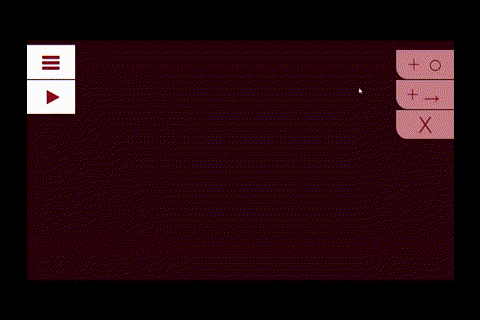
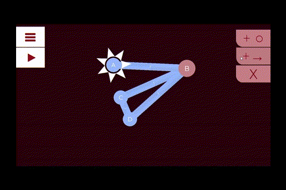
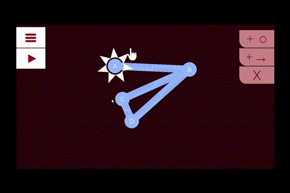
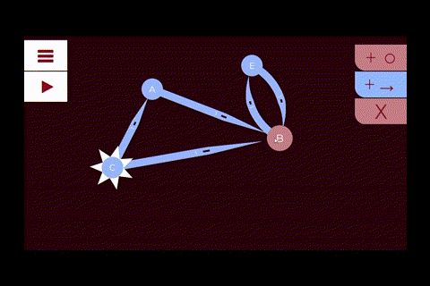
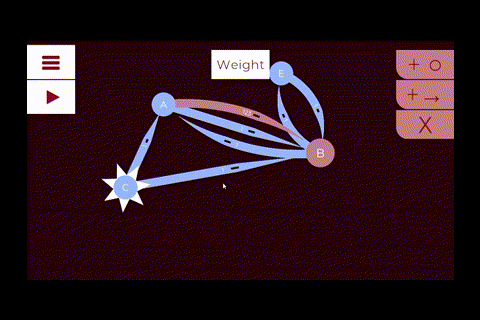
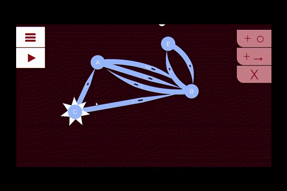

# graph-learn

An educational **Unity** project for learning graphs and graph traversal/visualization algorithms.

---

---

---

---

---

---

---

## Build

The ready-to-run build is located in **`builds/`** (for example, `builds/graph-learn.exe`).

